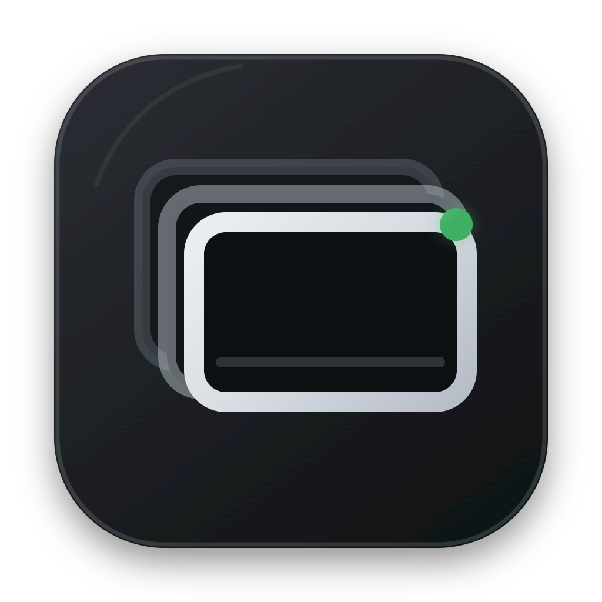
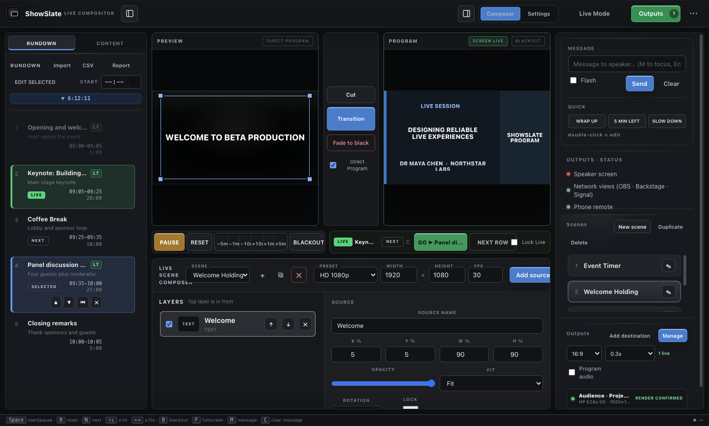
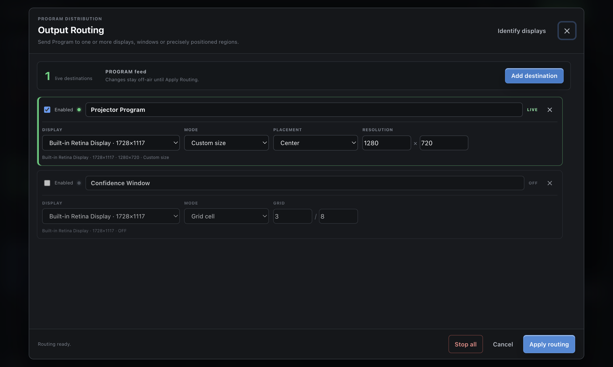
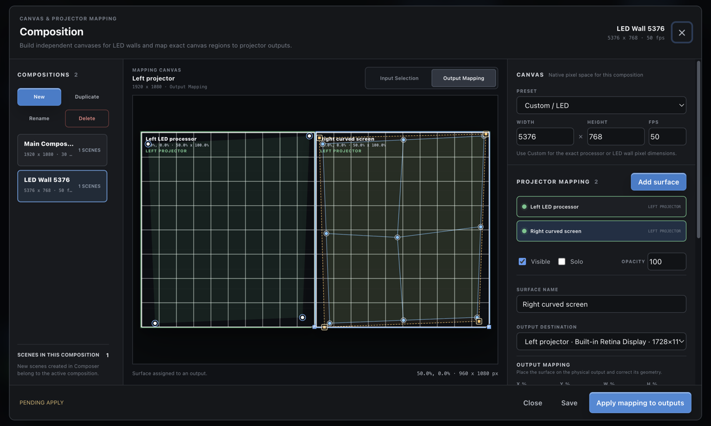

<p align="center">
  
</p>

<h1 align="center">ShowSlate</h1>

<p align="center">
  A local-first live compositor for layered scenes, Preview/Program switching, show control and multiple display outputs.
</p>

<p align="center">
  <a href="https://github.com/srdjankotarlic/showslate/actions/workflows/ci.yml"></a>
  <a href="https://github.com/srdjankotarlic/showslate/releases"></a>
  <a href="LICENSE"></a>
  
  
</p>

<p align="center">
  <a href="https://srdjankotarlic.github.io/showslate/"><strong>Product page</strong></a>
  ·
  <a href="#download-one-installer"><strong>Download</strong></a>
  ·
  <a href="docs/CONFERENCE-DESK.md"><strong>Conference workflow</strong></a>
  ·
  <a href="docs/USER-GUIDE.md"><strong>User guide</strong></a>
</p>

> [!WARNING]
> **Public beta / work in progress.** ShowSlate is actively developed and still has known bugs and unfinished hardware workflows. It is interesting and usable for evaluation, demos and off-air testing, but it is not production-certified. Test the exact computer, displays, media, capture devices and fallback plan before using it at a live event.



ShowSlate builds a visual Program from reusable layered scenes on one Mac or Windows PC. Combine pictures, video, PDF pages, colors, text, a timer, application windows, displays, cameras and UVC capture devices; prepare the result in **Preview**, use **TAKE** to send it to **Program**, then route Program to one or more local displays. Every destination can use its own output Canvas, resolution and scaling mode, with optional multi-surface projector mapping for irregular projection areas.

The included **Conference Desk** workflow adds a rundown, LIVE/NEXT/GO, speaker timing, cue-driven lower thirds, show-folder import and role-based room displays. It is intended for conferences, corporate events, education, community venues, houses of worship and small AV teams that need more structure than a media player but less complexity than a broadcast switcher.

> Need only a large countdown, OBS overlay, phone remote and simple rundown? Use the smaller **[ProTimer](https://github.com/srdjankotarlic/protimer)**. Choose ShowSlate when you need layered scenes, Preview/Program switching, live inputs or several controlled outputs.

## Live compositor workflow

1. Open **Composer**, choose the Canvas resolution and create a scene.
2. Add and arrange media, color, text, timing or a local live input as ordered layers.
3. Prepare the scene in Preview, verify it, then use **TAKE** or **Cut** to send it to Program.
4. Open **Outputs**, assign each destination to an explicit display, choose fullscreen/window placement and set its independent output Canvas, resolution and scaling.
5. For projectors or LED processors, open **Map projector**, create one or more surfaces, choose source pixels in **Input Selection**, then align them in **Output Mapping** before applying the route.
6. Enable Program audio on at most one local output when a video or capture source needs sound.

## The room workflow

1. Put `rundown.csv` or `schedule.tsv` and the event media in one folder.
2. Select **Import Show Folder**, review media matches and assign the Audience display.
3. Add any Confidence, Timer, Stream Graphics or Door Agenda destinations.
4. Run **Preflight** and **Test outputs**. A route is not marked live until its renderer confirms the current revision.
5. Enter **Live Mode**. Select the next cue, then press **GO**.

Selecting a row prepares NEXT and never changes LIVE. GO creates one transaction and sends one consistent Program revision. The built-in **Load conference demo** action lets you try the workflow without preparing files first.

## Output roles

| Role | Intended destination | What it shows |
|---|---|---|
| **Audience** | projector, LED wall or room display | Linked media, holding screens, timer and full Program content |
| **Confidence** | presenter confidence monitor | Current cue, next cue, speaker details, timer and urgent messages |
| **Timer** | dedicated stage timer display | A clean large timer and urgent messages only |
| **Stream Graphics** | transparent window for OBS or vMix testing | Lower thirds and show graphics without the room background |
| **Door Agenda** | display outside the room | Room name, current session, next session and clock |

Each role can be fullscreen, windowed, an exact pixel size or a grid region. ShowSlate does not silently move a route to another monitor when a display disappears.

## Multi-output and projector mapping



- Send the same live Program to multiple displays at the same time.
- Give every destination its own standard or custom Canvas resolution, frame rate and **Fit / Cover / Fill** scaling.
- Assign a fullscreen, windowed, exact-size or grid destination without changing the source scene.
- Build several independently named surfaces on one output and duplicate surfaces when preparing adjacent projectors or LED regions.
- Use **Input Selection** to crop the exact source pixels from a standard or custom composition Canvas.
- Use **Output Mapping** to position and rotate each surface, then choose four-corner perspective correction or a linear mesh up to 4 x 4 cells.
- Drag perspective, mesh and polygon-mask points directly on the output canvas. Use Grid, Checker or Crosshair calibration patterns with optional surface labels.
- Set per-surface visibility, Solo, opacity, edge overlap, blend gamma and black level while aligning multiple projectors.
- Apply mapping to the complete Program, not only to one media layer. Scene media, timer, text, logos and lower thirds stay together.
- Keep unavailable displays fail-closed: a missing projector is reported instead of silently moving the output elsewhere.

The mapper is still beta software. It provides perspective and bounded linear-mesh correction, polygon masks and manual edge blending, but it does not provide spline/Bezier warping, automatic camera calibration, projector color matching or certification for a particular venue chain. Calibrate and rehearse on the exact projectors, processors and surfaces before a live show.



## Composer and live sources

Open **Composer** to build the visual Program as an ordered stack of layers. A scene can combine:

- pictures, local video, PDF pages and solid colors;
- text and the live ShowSlate timer;
- an application window or an entire display;
- a camera or UVC capture card, with an optional audio input.

Set a standard, square, vertical, UHD or custom Canvas resolution and frame rate. Drag and resize sources in Preview, edit exact position, size, opacity, rotation and fit in the inspector, then use **TAKE** to send the prepared scene to Program. Preview remains private until TAKE unless **Direct Program** is explicitly enabled.

Live capture is local to the ShowSlate desktop app and its desktop output windows. Browser/OBS URLs do not carry local window, display or capture-card streams. Program audio is off by default and can be enabled on only one local output to prevent echo and feedback.

### Full-quality and large media

ShowSlate does not resize, recompress or transcode imported pictures and videos. Media up to 512 MB is normally cloned or copied into the app library; larger files are linked to their original disk location and streamed in byte ranges, so multi-gigabyte video does not need to be loaded into RAM or duplicated on the internal drive. Keep linked files and their external drive connected at the same path for the entire show.

Playback has no fixed ShowSlate file-size cap. The practical limit is the show computer, codec and media: prefer a fast local SSD, hardware-decodable MP4/H.264 or HEVC where supported, and rehearse the exact resolution, frame rate and output count. Very large still images must still be decoded into GPU/RAM memory. Portable `.showslate-show` and `.showslate-lt` packages intentionally remain limited to 200 MB per embedded asset; disk-linked media is not silently embedded.

## Download one installer

> **Choose one recommended installer for your computer.** GitHub's automatic `Source code` ZIP and TAR.GZ files are developer archives and will not install the app.

| Your computer | Recommended download | Install |
|---|---|---|
| Apple Silicon Mac (M1 or newer) | **[ShowSlate-0.11.0-beta.1-arm64.dmg](https://github.com/srdjankotarlic/showslate/releases/download/v0.11.0-beta.1/ShowSlate-0.11.0-beta.1-arm64.dmg)** | Open the DMG and drag **ShowSlate** to Applications. |
| Windows 10/11 x64 | **[ShowSlate-Setup-0.11.0-beta.1.exe](https://github.com/srdjankotarlic/showslate/releases/download/v0.11.0-beta.1/ShowSlate-Setup-0.11.0-beta.1.exe)** | Run Setup and follow the installer. |

The [portable Windows EXE](https://github.com/srdjankotarlic/showslate/releases/download/v0.11.0-beta.1/ShowSlate-0.11.0-beta.1-portable.exe) is an advanced no-install option. The previous [`0.10.0-beta.1`](https://github.com/srdjankotarlic/showslate/releases/tag/v0.10.0-beta.1) release remains available for comparison and rollback.

<details>
<summary><strong>First-launch security warning</strong></summary>

The public beta is not yet Apple-notarized or Windows Authenticode-signed.

- On macOS, confirm the app came from this repository, then use **System Settings > Privacy & Security > Open Anyway** if required.
- On Windows, SmartScreen may show **Unknown publisher**. Continue only for the installer downloaded from this repository.
- Optional integrity hashes are in [SHA256SUMS.txt](https://github.com/srdjankotarlic/showslate/releases/download/v0.11.0-beta.1/SHA256SUMS.txt).

</details>

See the [system requirements](docs/SYSTEM-REQUIREMENTS.md), [known limitations](docs/KNOWN-LIMITATIONS.md) and exact [beta verification](docs/PUBLIC-BETA-VERIFICATION.md). Intel Mac is not currently published.

## Show folder format

The importer scans the selected folder safely, manages smaller assets in ShowSlate storage, links large originals in place and conservatively matches each cue by the `media` filename or an exact cue title.

```csv
session,duration,speaker,speaker title,company,media,room
Opening,05:00,Ana Markovic,Conference Host,Example Events,opening.png,Main Room
Keynote,30:00,Dr Maya Chen,Keynote Speaker,Northstar,keynote.pdf,Main Room
Coffee Break,15:00,,,,break.png,Main Room
```

Supported folder media includes PNG, JPEG, WebP, GIF, AVIF, BMP, SVG, MP4, WebM, OGV, MOV, M4V and PDF. For Excel workbooks, export the rundown sheet as CSV/TSV or paste the rows into the wizard. Import behavior and the full column reference are in [Conference Desk workflow](docs/CONFERENCE-DESK.md).

## Included production tools

- Rundown with NEXT, LIVE, GO, planned times, actual timing and post-show CSV reports.
- Countdown, stopwatch and clock with warning colors, overtime, chimes and speaker messages.
- Screen content for images, video, PDF pages, text, logos, timer and blank states.
- Custom-resolution Composer with reusable scenes, ordered layers, Preview/Program switching and drag/resize editing.
- Window/display capture and camera/UVC capture-card layers with optional local Program audio.
- Lower Third Studio with cue-driven dynamic fields, shapes, logos, images and muted video.
- Explicit multi-display routing with per-destination Canvas settings, render acknowledgements and unavailable-display blocking.
- Multi-surface projector mapping with separate input/output transforms, perspective or linear-mesh warp, polygon masks, calibration patterns and manual edge-blend controls.
- Autosave, crash recovery and portable `.showslate-show` and `.showslate-lt` packages.
- Local phone remote, backstage view, Signal Light, HTTP and OSC control.
- English default UI, full Serbian UI and 35 core language packs with English fallback.

## Deliberate scope

ShowSlate can arrange live and media sources for local displays, but it is not a streaming encoder, multibus audio mixer, NDI router, PTZ controller or multi-room cloud platform. Keep OBS, vMix or dedicated production hardware where recording, streaming, broadcast audio or advanced switching is required. The product remains focused on dependable visual composition and show control for one operator and a small set of local destinations.

External OBS/vMix alpha behavior is not certified in this beta. Test the exact show computer, displays, network, media and capture path off-air before every event. Show-critical productions still need an independent fallback timer and rundown.

## Documentation

- [Conference Desk workflow and CSV reference](docs/CONFERENCE-DESK.md)
- [User Guide](docs/USER-GUIDE.md)
- [System Requirements](docs/SYSTEM-REQUIREMENTS.md)
- [Known Limitations](docs/KNOWN-LIMITATIONS.md)
- [Languages](docs/LOCALIZATION.md)
- [Companion / HTTP / OSC](docs/COMPANION.md)
- [Testing](docs/TESTING.md)
- [Signing and release](docs/SIGNING-AND-RELEASE.md)
- [Public beta verification](docs/PUBLIC-BETA-VERIFICATION.md)
- [Architecture](ARCHITECTURE.md)
- [Privacy](docs/PRIVACY.md)

## Build from source

Requires Node.js 22.12 or later.

```bash
git clone https://github.com/srdjankotarlic/showslate.git
cd showslate
npm ci
npm start
```

Run deterministic checks with `npm test`. Display and packaged renderer checks require an available graphical display; see [Testing](docs/TESTING.md).

## Privacy and network safety

The core workflow is local-first and does not require an account. Show files and imported media remain on the show computer unless the operator exports or shares them. Browser, remote, backstage and Signal Light pages are served on the trusted production LAN. Do not expose local ports directly to the public internet; see [Security](SECURITY.md) and [Privacy](docs/PRIVACY.md).

## Feedback

This is a public evaluation beta, not a production-certified release. Try the built-in demo off-air, then use [GitHub Discussions](https://github.com/srdjankotarlic/showslate/discussions) for workflow feedback or open a [bug report](https://github.com/srdjankotarlic/showslate/issues/new?template=bug_report.yml) with the app version, operating system, display setup and reproducible steps.

## License

[MIT](LICENSE) - free to use, modify and distribute. Keep the copyright and license notice with substantial copies.
