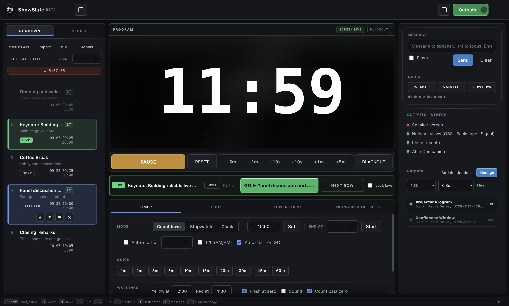
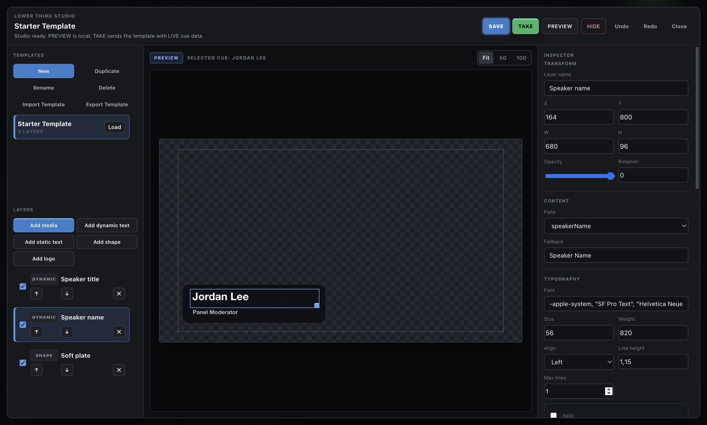

<p align="center">
  
</p>

<h1 align="center">ShowSlate</h1>

<p align="center">
  Free, open-source live event cue control for rundowns, speaker timing, lower thirds, screen content and multiple displays.
</p>

<p align="center">
  <a href="https://github.com/srdjankotarlic/showslate/actions/workflows/ci.yml"></a>
  <a href="https://github.com/srdjankotarlic/showslate/releases"></a>
  <a href="LICENSE"></a>
  
  
</p>

<p align="center">
  <a href="https://srdjankotarlic.github.io/showslate/"><strong>Product page</strong></a>
  ·
  <a href="#download-and-install"><strong>Download</strong></a>
  ·
  <a href="docs/USER-GUIDE.md"><strong>User guide</strong></a>
</p>



ShowSlate is a local-first live event control app for conferences, venues, churches and production teams. Build a rundown, prepare NEXT without disturbing LIVE, press GO, run the speaker timer, create lower thirds and route Program to several displays from one operator workspace.

> Need only a fast countdown, OBS overlay, phone remote and simple rundown? Use the smaller **[ProTimer](https://github.com/srdjankotarlic/protimer)** app. Choose **ShowSlate** for a cue-driven NEXT/LIVE/GO workflow, lower thirds, screen content and multiple independent outputs.

## Download and install

> **Download exactly one recommended installer for your computer.** GitHub's automatic `Source code` ZIP and TAR.GZ files are developer archives and will not install the app.

| Your computer | Recommended download | Install |
|---|---|---|
| Apple Silicon Mac (M1 or newer) | **[Download the macOS DMG](https://github.com/srdjankotarlic/showslate/releases/download/v0.9.0-beta.3/ShowSlate-0.9.0-beta.3-arm64.dmg)** | Open the DMG, then drag **ShowSlate** to Applications. |
| Windows 10/11 x64 | **[Download the Windows installer](https://github.com/srdjankotarlic/showslate/releases/download/v0.9.0-beta.3/ShowSlate-Setup-0.9.0-beta.3.exe)** | Run Setup and follow the installer. |

Need a Windows build that does not install? Use the [portable EXE](https://github.com/srdjankotarlic/showslate/releases/download/v0.9.0-beta.3/ShowSlate-0.9.0-beta.3-portable.exe). This is an advanced option; most Windows users should choose Setup.

<details>
<summary><strong>First-launch security warning</strong></summary>

The public beta is not yet Apple-notarized or Windows Authenticode-signed.

- On macOS, open **System Settings → Privacy & Security** and choose **Open Anyway** after confirming the app came from this repository.
- On Windows, SmartScreen may show **Unknown publisher**. Continue only for the installer downloaded from this repository.
- Optional integrity hashes are in [SHA256SUMS.txt](https://github.com/srdjankotarlic/showslate/releases/download/v0.9.0-beta.3/SHA256SUMS.txt).

</details>

See [system requirements](docs/SYSTEM-REQUIREMENTS.md), [known limitations](docs/KNOWN-LIMITATIONS.md) and the exact [verification evidence](docs/PUBLIC-BETA-VERIFICATION.md). Intel Mac is not currently published.

## How it works

1. **Build the rundown.** Create a show, paste rows from Excel or Google Sheets, or import CSV/TSV.
2. **Prepare NEXT, then press GO.** Selecting a cue never changes LIVE. **GO NEXT** updates the live cue and timer together.
3. **Send Program where it belongs.** Route the timer, lower third or screen content to one or more fullscreen, windowed, pixel-sized or grid-cell outputs.

The complete operator workflow is in the [User Guide](docs/USER-GUIDE.md).

## What it controls

- Countdown, stopwatch and clock with warning colors, overtime and scheduled start.
- Rundown-first **NEXT / LIVE / GO** workflow with autosave, recovery and reports.
- Speaker messages, phone remote, backstage view and podium Signal Light on the local network.
- Lower Third Studio with dynamic cue fields, text, shapes, logos, images and muted video.
- Screen content for images, video, PDF pages, text, logos, timer and blank states.
- Multiple Program destinations with explicit display assignment and no silent monitor fallback.
- HTTP and OSC control plus portable `.showslate-show` and `.showslate-lt` packages.
- English and Serbian full UI, plus 35 core language packs with English fallback.

ShowSlate is event-control software, not a video switcher or a replacement for show-critical hardware redundancy. Test the exact computer, displays, network and media off-air before every event.

## Product views

| Lower Third Studio | Output Routing |
|---|---|
|  |  |

## Existing projects

ShowSlate automatically copies compatible local projects and settings from the former **ProTimer Studio** app on first launch. The old data is left untouched. New exports use `.showslate-show` and `.showslate-lt`; legacy `.protimer-show` and `.protimer-lt` packages remain importable.

## Local network safety

The app serves output, remote, backstage and Signal Light pages on the production LAN. Control/API links include a per-launch token, while several read-only views are intentionally accessible on the local network. Use a trusted show network and do not expose ports directly to the public internet. See [Security](SECURITY.md).

## Documentation

- [User Guide](docs/USER-GUIDE.md)
- [System Requirements](docs/SYSTEM-REQUIREMENTS.md)
- [Known Limitations](docs/KNOWN-LIMITATIONS.md)
- [Languages](docs/LOCALIZATION.md)
- [Companion / HTTP / OSC](docs/COMPANION.md)
- [Testing](docs/TESTING.md)
- [Signing and release](docs/SIGNING-AND-RELEASE.md)
- [Release readiness](docs/RELEASE-READINESS.md)
- [Public beta adoption](docs/BETA-ADOPTION.md)
- [Public beta verification](docs/PUBLIC-BETA-VERIFICATION.md)
- [Architecture](ARCHITECTURE.md)
- [Privacy](docs/PRIVACY.md)

## Build from source

Requires Node.js 22.12 or later.

```bash
git clone https://github.com/srdjankotarlic/showslate.git
cd showslate
npm ci
npm start
```

Headless tests:

```bash
npm test
npm audit
```

Local package builds:

```bash
npm run dist:mac
npm run dist:win
```

## Feedback

This beta exists to learn from real operators. Start with [GitHub Discussions](https://github.com/srdjankotarlic/showslate/discussions), or open a [bug report](https://github.com/srdjankotarlic/showslate/issues/new?template=bug_report.yml) with the app version, operating system, display setup and reproducible steps.

Contributions are welcome; read [CONTRIBUTING.md](CONTRIBUTING.md) first. Security issues should use GitHub's private vulnerability reporting instead of a public issue.

## Language support

English is the default interface. Serbian also has full interface coverage and can be selected from the language menu. The other 35 language packs cover core operator controls and use English fallback for advanced areas; see [Languages](docs/LOCALIZATION.md) for the exact coverage policy.

## License

[MIT](LICENSE) — free to use, modify and distribute. Please keep the copyright and license notice with substantial copies.
