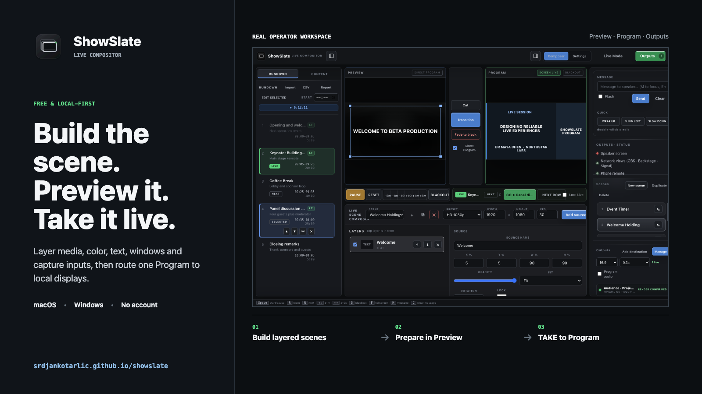

# ShowSlate Live Compositor public beta plan

The immediate objective is not a large download number. It is to learn whether a real single-room operator can prepare, preflight and run a conference without manually synchronizing a spreadsheet, timer, media folder and speaker graphics.

## First validation cohort

Recruit 8 to 10 people from these roles:

- freelance AV technicians who run corporate conferences;
- in-house conference-center or hotel AV operators;
- university or training-room technicians;
- small production teams using a projector plus confidence monitor;
- one OBS/vMix operator who can evaluate Stream Graphics off-air;
- at least one Windows operator with two physical displays.

At least three should complete the room workflow below. At least one independent operator must complete a documented beta with no unresolved release blocker before any stable claim.

## Operator task

1. Install the beta on a non-critical computer.
2. Run **Load conference demo** and identify the attached displays.
3. Assign Audience and Confidence roles, then run **Test outputs**.
4. Select NEXT and complete three GO transitions.
5. Confirm timer, linked media and speaker lower third stay on the same cue.
6. Send and clear one presenter message.
7. Disconnect and reconnect one output display, then confirm fail-safe behavior.
8. Import a small real or anonymized CSV/media folder.
9. Export and reopen a `.showslate-show` package.
10. Report the first confusing step, any incorrect output and whether this would replace part of their current room workflow.

Ask for app version, OS, CPU, display arrangement and exact reproduction steps. Never ask testers to publish client names, speaker data, private IP addresses, tokens or confidential media.

## Natural outreach copy

### Suggested Reddit title

`Free offline conference room control app - looking for AV operators to test it off-air`

### Suggested post

I built ShowSlate as a local live compositor for small productions that need layered media and live inputs, Preview/Program switching and controlled display outputs. It also includes a Conference Desk workflow for rundowns, speaker timing and cue-driven graphics.

Import a CSV/TSV and its media, assign Audience/Confidence/Timer/Stream/Door outputs, run preflight, then use one GO to update the live cue, timer, linked content and lower third.

It is free, open source and local-first for Apple Silicon Mac and Windows x64:
https://srdjankotarlic.github.io/showslate/

I am looking for room operators willing to try the built-in demo off-air and tell me where the workflow is unclear or wrong. It is a public beta, unsigned, and external OBS/vMix alpha capture is not certified.

Use the current social preview with the post:

## Feedback and metrics

- Bugs: GitHub bug-report form.
- Setup questions and workflow feedback: [GitHub Discussions](https://github.com/srdjankotarlic/showslate/discussions).
- Private security issues: GitHub private vulnerability reporting.
- Weekly signals: completed operator workflows, first-run blockers, unresolved defects, repository visitors/clones and release-asset counters.

GitHub asset counters are aggregate downloads, not verified people, installations or successful room tests. The primary success metric is a completed independent workflow with enough evidence to reproduce and fix failures.

## Weekly loop

1. Invite a small relevant group instead of repeating the same post broadly.
2. Reproduce every credible issue on the same viewport/output role before changing the product.
3. Fix setup and live-output blockers before adding features.
4. Publish a beta only after source, packaged and designated-display gates pass.
5. Ask the original reporter to retry the exact failed step.
6. Stop expanding scope if operators do not value the Conference Desk workflow after three complete pilots.
